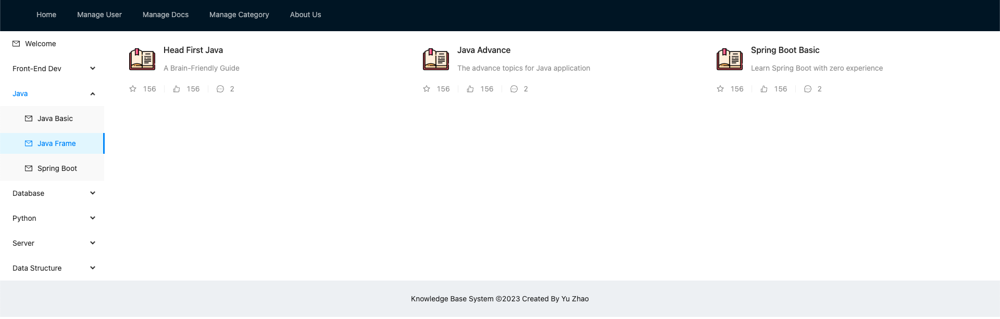

# Online Knowledge Base Application

This project is still under development, will keep updating.

# Overview

This is an online knowledge base application where users can create their own accounts and manage their knowledge documents with a clear and easy-to-use interface. The main features include:

### Features

- Account management, log in to enable more features
- Documents
    - Document edit, support RTF
    - management, including category & doc management with tree structure layout
- Statistic
    - Display view and like count
    - History statistic and forecast chart
- More features will coming soon:
    - Log in validation
    - Times task
    - WebSocket web-site notice

### Tech

Tech stack

- Back-end: Java + Spring Boot + MyBatis
- Front-end: Vue
- Database: MySQL

# Feature Display

Some features are under development, will keep updating at here

## Document Management

Find docs by category

 
 

Manage docs

 
 

Add/Edit Doc Info

 
 

Manage Category

 
 

## Document Edit (under development)

 
 

## Data Statistic (under development)